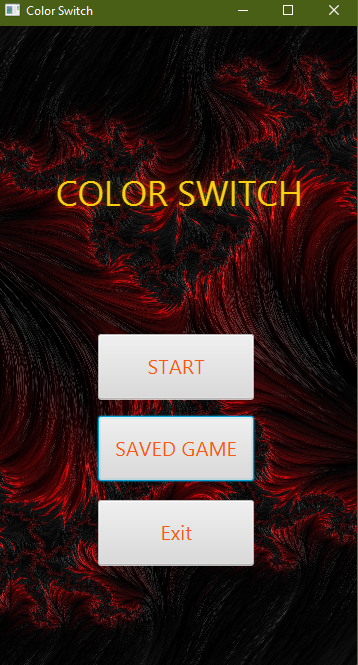
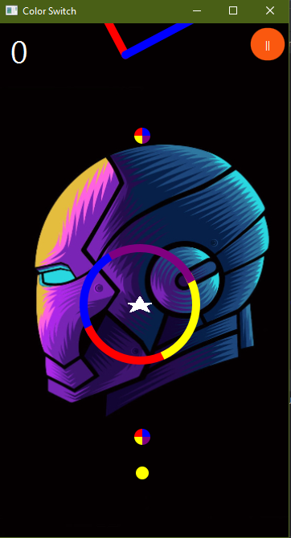
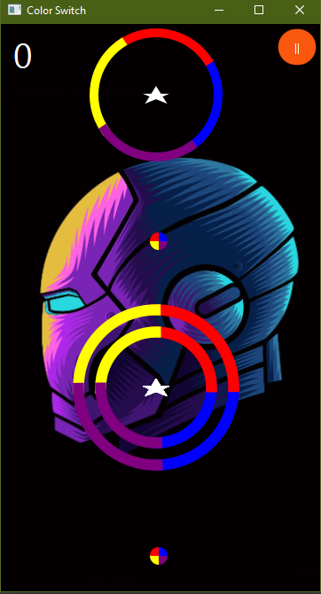
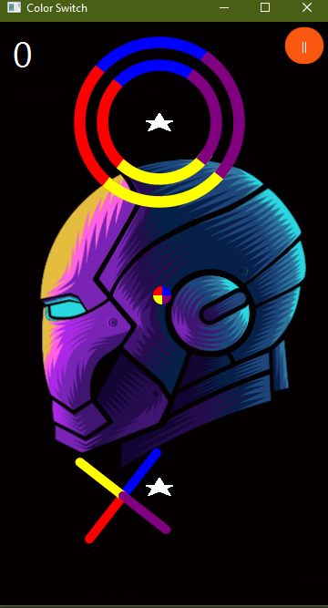
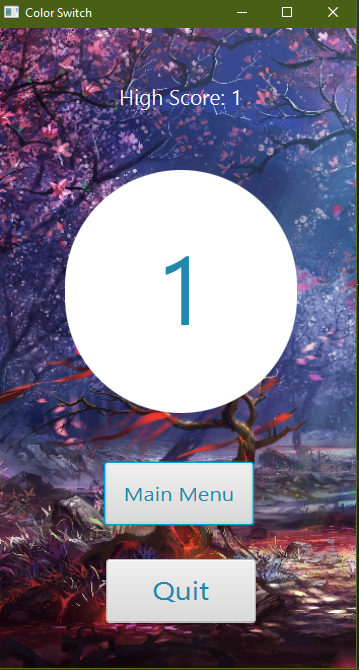

# Color-Switch using JavaFx
>[`Contributors:`](/ColorSwitch.pdf)
- [Nikhil Kushwah](https://github.com/limitless-sky)
- [Shubham Lohan](https://github.com/shubham-lohan)

>`Purpose:` Course Project at [IIITD](https://www.iiitd.ac.in/)

>[`Instructions:`](/instructions.pdf) (Credits- [Advanced Programming](http://techtree.iiitd.edu.in/viewDescription/filename?=CSE201))

>`Gameplay Screenshot`

&nbsp
&nbsp
&nbsp
&nbsp
&nbsp

Color-Switch using JavaFx. The objective of the game is to collect as many stars as possible by manoeuvring the obstacles. If you hit any obstacle, you can continue with your earned stars or the game ends and you have to start from the beginning. This is a high score game. We will be developing only the endless (infinity) game mode of the classic gameplay.
with your earned stars or the game ends and you have to start from the beginning. This is a high score game. We will be developing only the endless (infinity) game mode of the classic gameplay.

